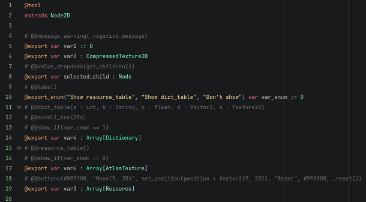
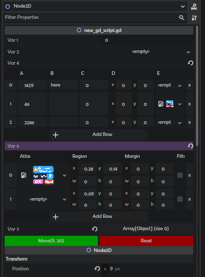

# Inspector Extender

A plugin for Godot 4 to extend the Inspector using just comments above properties. Nodes, Resources, and even non-tool scripts supported!

It allows the user to do this:

...with just this.

Comments must be placed any number of lines before the property they must be applied to (*place anything in between, just not other properties*)

Supported commentributes:

# Extras

## @@message(`message_func`), @@message_warning(`message_func`), @@message_error(`message_func`)

Call `message_func` that returns a message string to display a message. When the function returns and empty string, no message is displayed.

## @@buttons(`params`)

Displays a button group. The `params`, comma-separated, must contain expressions (*like `set_position(position + Vector2(9, 20))`*), preceded by a name (*inside quotation marks `" "`*) and optionally a color code (*like `#009900`*)

To display a red "Reset" button that calls `_reset`, write: `# @@buttons("Reset", #990000, _reset())`.

**Note:** Assignment `=` `+=` `*=` `-=` `/=` not supported, use setter functions instead.

**Note:** Translating nodes in viewport has unpredictable behaviour. Clues on fixes appreciated.

# Tables

**Note:** if array is empty, properties will be pinned. This is done automatically and required for it to work properly.

## @@resource_table(`properties...`)

Displays list of resources as a table. Optionally, list `properties` to display.

## @@dict_table(`properties...`)

Displays list of dictionaries as a table. The `properties`, comma-separated, must be in format of `key : type`, where `key` is the dictionary's key and `type` is the name of its datatype.

To store a table of dictionaries each containing a number `a`, a 2d-vector `b` and a texture `c`, write `# @@dict_table( a : int, b : Vector2, c : Texture2D)`.

## @@array_table(`properties...`)

Displays list of arrays as a table. Similar to `# @@dict_table`.

## @@multi_array_table(`properties_to_show...`)

Displays several typed arrays as a table. `properties_to_show` is a comma-separated list of properties that store arrays.

Arrays must have a type hint (`var array : Array[float]`, not `var array : Array`)

# Other

## @@scroll_box(`height`)

Puts a table into a scrollable container of maximum size `height`.

## @@show_if(`expression`)

Hides property if `expression` evaluates to `false`.

## @@value_dropdown(`expression`)

An option button that evaluates `expression` to get values to choose from. The expression may return an Array or a Dictionary.

## @@tabs()

Displays enum as tabs. Can be used to speed up enum switching, or with `@@show_if` to only show a group when enum is of a specific value.

# More commentributes coming soon.

#
Made by Don Tnowe in 2023.

[My Website](https://redbladegames.netlify.app)

[Itch](https://don-tnowe.itch.io)

[Twitter](https://twitter.com/don_tnowe)

Copying and Modification is allowed in accordance to the MIT license, full text is included.
